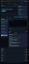

# 🛡️ CyberSim — Ethical Attack Simulator

An **interactive**, self-contained lab for demonstrating common web/network
attacks and — just as importantly — how to detect and fix them. Every attack
runs **only** against intentionally-vulnerable Docker containers on an isolated
network. It never touches external systems.

> ⚠️ **For authorized security education and defensive testing only.**
> A safety guard (`backend/app/safety.py`) rejects any target that isn't on the
> local allowlist before a single packet is sent.

---

## ✨ What it does

| Layer | Tech | Purpose |
|-------|------|---------|
| Targets | Docker | DVWA, custom vulnerable Node.js API, weak SSH server |
| Attack engine | Python | SQLi, brute force, XSS, port scan (Nmap), low-rate DDoS sim |
| Backend | FastAPI + WebSocket | Launch attacks, stream live logs, store history |
| Dashboard | React + TypeScript | Select attack → launch → watch live logs → read AI analysis → download report |
| AI Explainer | OpenAI (optional) | Explains the attack, the vulnerability, the fix, and MITRE ATT&CK mapping |
| Reports | fpdf2 | PDF with executive summary, technical detail, remediation |
| SIEM | Webhook | Forwards every event to **SecureWatch** with a shared `correlation_id` |

## Screenshots

### CyberSim dashboard


### Live analysis and attack workflow



## New in this expanded version

- Executive KPI strip in the dashboard: total runs, confirmed findings,
  campaigns, and average risk score.
- Defensive playbooks for every simulation: severity, business impact,
  detection signals, triage questions, SecureWatch query, and remediation.
- `/api/metrics` endpoint for SOC-style summary data.
- `/api/defense/playbooks` endpoint for reusable detection guidance.
- PDF reports now include a SOC Detection Playbook section.
- New guided scenario: **Incident Response Drill**, built for analyst demos.
- New target: **OWASP Juice Shop** at `http://localhost:3002`.
- New two-face dashboard view: vulnerable app + attack/detection console.
- New industry-tool modules: `sqlmap_juice` and `hydra_bruteforce`.
- New manual toolbox container: `cybersim-attacker-tools` with `sqlmap`,
  `hydra`, `nmap`, `curl`, and `jq`.
- New **Remediation Lab** panel with fix steps, secure code patterns, files to
  inspect, and validation checks for each attack type.
- Smaller Docker build contexts via service-level `.dockerignore` files.

---

## 🚀 Quick start

**Windows (one click):** run `start.bat` — it checks Docker, creates `.env`,
builds and launches the whole stack, waits for the backend, and opens the
dashboard. `stop.bat` tears it down.

**Any OS:**

```bash
cp .env.example .env          # optional: add OPENAI_API_KEY / SecureWatch webhook
docker compose up --build
```

The stack is health-gated: the dashboard waits for the backend, the backend
waits for a healthy database, and every target exposes a healthcheck — so
`docker compose up` comes up in the right order and self-heals on restart. On
first launch the DB is seeded with one sample run so the dashboard isn't empty.

Then open:

| Service | URL |
|---------|-----|
| **Dashboard** | http://localhost:5173 |
| Backend API / docs | http://localhost:8000/docs |
| DVWA | http://localhost:4280 |
| OWASP Juice Shop | http://localhost:3002 |
| Vulnerable Node API | http://localhost:3001 |
| Weak SSH | `ssh labuser@localhost -p 2222` (pw: `password123`) |

Manual pentest toolbox:

```bash
docker exec -it cybersim-attacker-tools bash
```

Inside that container, targets are addressed by Docker service name, for example
`juice-shop:3000`, `vuln-node-api:3001`, and `weak-ssh:22`.

The AI Explainer and SecureWatch forwarding are **optional** — leave the keys
blank in `.env` and CyberSim uses its built-in offline explanations and skips
SIEM forwarding, so the full demo still works standalone.

---

## 🎮 Using the dashboard (interactive flow)

1. **Select Attack** — pick a module (SQL Injection, Brute Force, XSS, Port Scan, DDoS Sim).
2. **Configure & Launch** — the target defaults to the right lab container; tweak params; hit **🚀 Launch Attack**.
3. **Live Attack** — watch the progress bar and streaming logs over WebSocket, with a success/fail indicator.
4. **AI Explainer** — once finished, read what happened, the vulnerability, the fix, and the MITRE technique.
5. **Download PDF Report** — one click for an executive + technical report.
6. **Attack History** — every run is stored in PostgreSQL and re-openable.

---

## 🤖 Guided scenarios & auto-campaigns

Switch to the **Guided Scenario (auto)** tab to launch a whole chain of attacks
with one click. Each scenario runs its steps in sequence, correlated under a
single campaign ID (and one SIEM trail), with a live step-by-step progress view
and a consolidated PDF report.

| Scenario | Steps |
|----------|-------|
| **Web Application Pentest** | port scan → SQL injection → XSS |
| **Credential Attack** | HTTP brute force → SSH brute force |
| **Full Recon → Exploit** | all five modules end to end |

Scenarios are defined in `backend/app/scenarios.py` — add your own by appending
to the `SCENARIOS` dict.

## ✅ Continuous integration

`.github/workflows/ci.yml` runs on every push: frontend type-check + build,
backend byte-compile + import smoke test, and `docker compose config` validation.
Run the same checks locally with `validate.bat`.

## 🔗 SecureWatch SIEM integration

Set `SECUREWATCH_WEBHOOK_URL` in `.env`. CyberSim POSTs every event as:

```json
{
  "source": "CyberSim",
  "event_type": "simulated_attack",
  "correlation_id": "a1b2c3d4e5f6...",
  "attack_type": "sql_injection",
  "target": "vuln-node-api",
  "level": "success",
  "message": "Injection succeeded ...",
  "timestamp": "..."
}
```

SecureWatch raises its own detection; match on `correlation_id` to prove the
SIEM saw the attack in real time. The same ID is printed in the PDF report.

---

## 🧩 Attack modules

| Module | Target | MITRE | Notes |
|--------|--------|-------|-------|
| `sql_injection` | vuln-node-api | T1190 | Auth-bypass & UNION-style dump payloads |
| `brute_force` | vuln-node-api / weak-ssh | T1110 | HTTP login or SSH, no lockout |
| `xss` | vuln-node-api | T1059.007 | Reflected-XSS detection |
| `port_scan` | any lab host | T1046 | Nmap with TCP-connect fallback |
| `ddos_sim` | any lab host | T1498 | **Hard-capped** low-rate load test (≤200 req, ≤20 concurrent) |
| `sqlmap_juice` | juice-shop | T1190 | Conservative sqlmap profile against OWASP Juice Shop |
| `hydra_bruteforce` | weak-ssh / juice-shop | T1110 | Hydra credential audit with bounded local wordlists |

---

## 🔒 Safety design

- **Allowlist guard**: targets must be lab container names or resolve to a
  private/loopback IP. Public IPs are rejected with HTTP 403.
- **DDoS caps**: request count and concurrency are hard-limited in code and
  cannot be overridden via params.
- **Isolated network**: all containers share a dedicated bridge network.
- **Disposable targets**: the vulnerable apps are intentionally insecure and
  must never be deployed anywhere public.

---

## 🗂️ Project structure

```
CyberSim/
├── docker-compose.yml
├── .env.example
├── backend/            FastAPI + attack engine + AI + PDF
│   └── app/
│       ├── main.py         REST + WebSocket
│       ├── engine.py       orchestration
│       ├── safety.py       target allowlist guard
│       ├── ai_explainer.py OpenAI + offline KB
│       ├── report.py       PDF generator
│       ├── securewatch.py  SIEM forwarder
│       └── attacks/        the 5 attack modules
├── dashboard/          React + TypeScript UI
└── targets/            vulnerable-node-api, weak-ssh (+ DVWA image)
```
